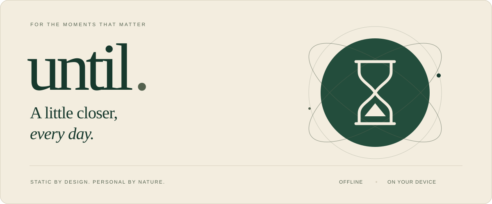
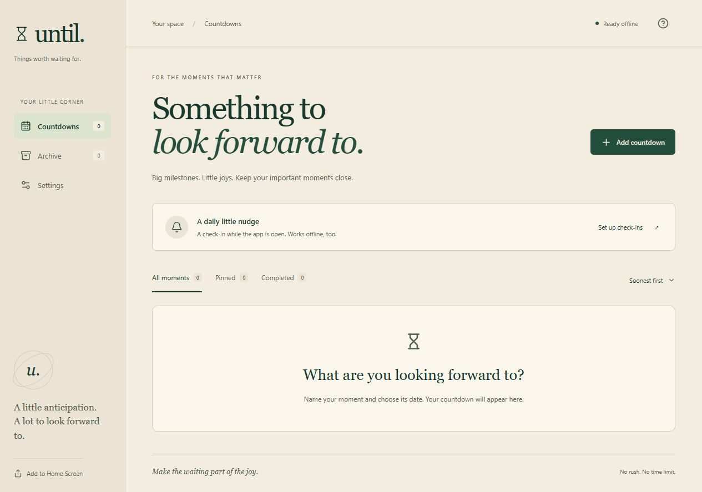
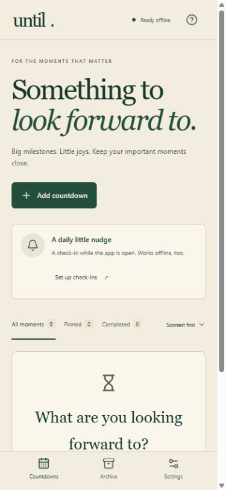

<picture>
  <source media="(prefers-color-scheme: dark)" srcset="docs/assets/banner-dark.svg">
  <source media="(prefers-color-scheme: light)" srcset="docs/assets/banner-light.svg">
  
</picture>

<h1 align="center">For the moments that matter.</h1>

  A quiet, beautiful home for your important countdowns. 
  Name a moment. Set a date. Watch it get a little closer.

  
  
  
  

  <a href="#features">Features</a> ·
  <a href="#get-started">Get started</a> ·

---

## A little anticipation. A lot to look forward to.

Until brings your milestones together in a calm space: warm beige, forest green, thoughtful typography, and gentle motion. Keep several countdowns, from next week to centuries away, with calendar-aware time remaining and a daily check-in while the app is open.

It runs as a static web app, installs on your Home Screen, and works offline after setup. Your collection stays in your browser. No account is needed.

<picture>
  <source media="(prefers-color-scheme: dark)" srcset="docs/assets/app-dark.png">
  
</picture>

A fresh collection starts empty. Every moment you add is your own.

<strong>A closer look on your phone</strong>

  <picture>
    <source media="(prefers-color-scheme: dark)" srcset="docs/assets/phone-dark.png">
    
  </picture>

## Features

| Your moments | Your rhythm |
| :--- | :--- |
| **Count days, months and years.** Create multiple named countdowns with no arbitrary duration cap. See calendar years, months, days and hours, or total days. | **A daily little nudge.** Choose a local check-in time, with an optional override for each countdown. Reopen later that day to catch up. |
| **Keep the important ones close.** Pin favourites, sort your collection, edit or duplicate a countdown, and archive moments you want to remember. | **Timezones that make sense.** Event dates keep their chosen timezone. Check-ins can follow your device, including daylight-saving changes. |
| **Make it feel like home.** Choose colours, symbols and notes. Switch between light, dark and system appearance, with motion that respects your device settings. | **Take it with you.** Install on iPhone or iPad, reopen offline, and export or restore a backup when moving devices. |

> **About reminders:** daily check-ins appear inside Until while it is visible. This static version cannot send scheduled notifications when the app is closed or the phone is locked.

## Get started

### Open the ready-made app

Extract **Until-github-pages.zip** and open `index.html`, or double-click **Until.html**. The built HTML includes its own code and styles. Use the built download for this route; the source entry point requires the development server or a build.

For Home Screen installation, publish the app over HTTPS, then open it in Safari:

1. Tap **Share → Add to Home Screen**.
2. Open the Until icon while online.
3. Wait for **Ready offline** before taking it offline.

*Settings → Export backup** before changing devices, moving the app to another address, or clearing website data. **Import backup** validates the collection before replacing it. Unreadable saved data is preserved for recovery; blocked storage is clearly marked **Session only**.

<strong>Storage, updates and security details</strong>

- Browser storage and exported backups are not encrypted. Keep private notes and backup files accordingly.
- A local-file collection and a hosted collection use separate storage. Export and import to move between them.
- Offline readiness checks the complete cache. Clearing website data removes both the collection and the offline app; browsers may also reclaim storage.
- Updates download a complete version before offering **Update & reopen**. Save or cancel open edits first.
- Generated HTML includes a script/style hash policy. Publish complete builds together; rebuild rather than hand-editing the generated HTML or worker.

---

  <strong>Make the waiting part of the joy.</strong> 
  Until · Things worth waiting for.

